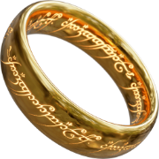

<a id="readme-top"></a>
<br />

<div align="center">
  <a href="https://github.com/othneildrew/Best-README-Template">
    
  </a>

  <h3 align="center">Lord of the Rings</h3>
   <a href="https://lotrtheone.netlify.app/">View Demo</a>
</div>

<p align="center">
  
</p>

## 🔎 About

This website was built with the Lord of the Rings API.

### Tools:

- [![Vite][vite]][vite-url]
- [![React][react.js]][react-url]
- [![Sass][sass]][sass-url]

## 🚀 Ejecution

Steps to install and run the project:

1. Clone the project
   ```sh
   git clone https://github.com/diaslucia/lotr.git
   ```
2. Open your current directory project
   ```sh
   cd yourProjectDirectory
   ```
3. Install the libraries
   ```sh
   npm install
   ```
4. Create an account in https://the-one-api.dev/ to get an API KEY
5. Create an `.env` file to enter your API KEY
   ```js
   VITE_API_KEY = yourAPIKEY;
   ```
6. Ejecute the app (and close it with Ctrl + C)

   ```sh
   npm run dev
   ```

## 📂 Structure

The structure of the files is:

- assets: to store images.
- components: to store all componentes.
- layouts: to store basic structure layout.
- utils: to store sass global styles.

```
src/
┣ assets/
┃ ┗ images/
┣ components/
┃ ┣ CharactersContainer/
┃ ┣ Footer/
┃ ┣ Home/
┃ ┣ MoviesContainer/
┃ ┣ NavBar/
┃ ┣ Spinner/
┣ hooks/
┃ ┗ useWindowSize/
┣ layout/
┃ ┣ Header/
┃ ┣ Main/
┣ utils/
┃ ┗ sass/
```

## 🛠 Libraries

**[Framer-motion](https://www.framer.com/motion/)**: to animate components.

**[React Router Dom](https://reactrouter.com/en/main)**: To manage navigations and pages.

**[React Icons](https://react-icons.github.io/react-icons/)**: to display icons.

**[React Paginate](https://github.com/AdeleD/react-paginate#readme)**: to use paginations in the characters page.

**[React Spinners](https://www.davidhu.io/react-spinners/)**: to display spinners while we wait for the API response.

<p align="right">(<a href="#readme-top">to Top</a>)</p>

[react.js]: https://img.shields.io/badge/React-20232A?style=for-the-badge&logo=react&logoColor=61DAFB
[react-url]: https://reactjs.org/
[vite]: https://img.shields.io/static/v1?style=for-the-badge&message=Vite&color=646CFF&logo=Vite&logoColor=FFFFFF&label=
[vite-url]: https://vitejs.dev/
[sass]: https://img.shields.io/static/v1?style=for-the-badge&message=Sass&color=CC6699&logo=Sass&logoColor=FFFFFF&label=
[sass-url]: https://sass-lang.com/
